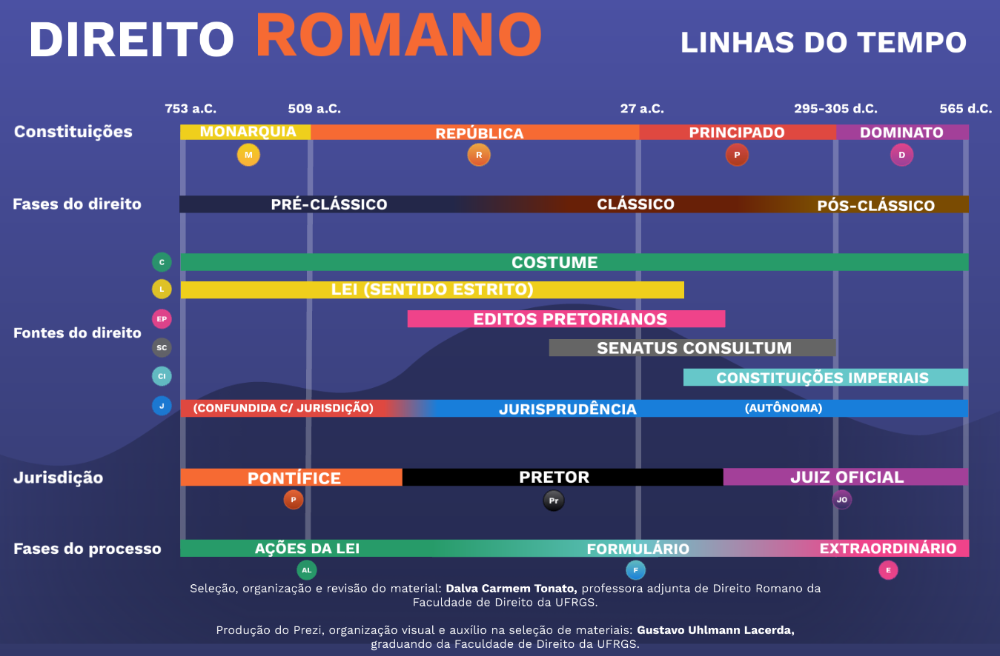

# Referências Bibliográficas

Este arquivo contém as referências bibliográficas das imagens utilizadas neste repositório e que podem ser referenciadas em outros repositórios e fontes da gestão do conhecimento.

## Norma ABNT NBR 6023/2018

Este repositório observa as normas de referências bibliográfias estabelecidas pela **[ABNT NBR 6023/2018](https://github.com/dnlclaudino/normas-de-padronizacao-nacional-internacional/blob/master/norma-ABNT-6023-2018-referencias-bibliograficas/README.md) (Informação e documentação — Referências —
Elaboração)**.

Existe um repositório com resumos e resenhas, além das próprias normas, para todas as fontes relacionadas à [normas nacionais e internacionais](https://github.com/dnlclaudino/normas-de-padronizacao-nacional-internacional#readme)

## Relação de Imagens

|Imagem|Descrição|Link|Fonte|Referência (ABNT NBR 6023/2018)|Observação/Anotação|
|:---:|:---|:---|:---|:---|:---|
||Períodos da História|[Copie e cole](https://github.com/dnlclaudino/historia/blob/master/imagens/periodos-da-historia.png?raw=true)|- Site [Super História](https://4.bp.blogspot.com/-lU-5mNzyE6o/W083cz3zMlI/AAAAAAAAF9U/ncWOkmSPRxgnLbsfIUws1BWYnvFmoXVqwCLcBGAs/s1600/Periodos%2Bda%2BHist%25C3%25B3ria.jpg.png) - Professor Ricardo J. J. Laub Júnior |LAUB JÚNIOR, Ricardo J. J. **Esquema: Períodos da História**. 2024. [S.l.]:Site SUPER HISTÓRIA. 1 imagem no formato PNG. Disponível em: [blogspot.com](https://4.bp.blogspot.com/-lU-5mNzyE6o/W083cz3zMlI/AAAAAAAAF9U/ncWOkmSPRxgnLbsfIUws1BWYnvFmoXVqwCLcBGAs/s1600/Periodos%2Bda%2BHist%25C3%25B3ria.jpg.png) Acesso em: 11 jan. 2024|Uma imagem contendo de forma resumida todos os períodos da história, com datas e evento principal (pré-história, idade antiga, idade média, idade moderna, idade contemporânea).|
||Principais Períodos Históricos da Civilização Romana na Idade Antiga|[Copie e cole](https://github.com/dnlclaudino/historia/blob/master/imagens/idade-antiga/idade-antiga-roma-principais-periodos-2048x989.png?raw=true)|- Site [Humanidades.com](https://humanidades.com/wp-content/uploads/2023/03/roma-antiga.png) - Enciclopédia Humanidades - Editora Etecé|EDITORA ETECÉ. **Roma Antiga**: Principais Períodos. 2024. 1 imagem no formato PNG. 2048x989 pixels. Disponível em: [humanidades.com](https://humanidades.com/wp-content/uploads/2023/03/roma-antiga.png) Acesso em: 11 jan. 2024|Uma imagem contendo de forma resumida os períodos históricos da civilidação romana na IDADE ANTIGA.|
||Direito Romano - Fases|[Copie e cole](https://github.com/dnlclaudino/historia/blob/master/imagens/idade-antiga/direito-romano-fases.png?raw=true)|- Site [prezi.com][https://prezi.com/p/c1yjvedsl-su/linhas-do-tempo-direito-romano/) - Dalva Carmem Tonato - Gustavo Uhlmann Lacerda|FACULDADE DE DIREITO UFRGS. <b>Direito Romano - Linhas do Tempo<b>. 2024. 1 imagem no formato PNG. Elaborado por: Gustavo U. Lacerda. Prof. Dalva Carmem Tonato (coord., rev.). Disponível em: [prezi.com](https://prezi.com/p/c1yjvedsl-su/linhas-do-tempo-direito-romano/) Acesso em: 11 jan. 2024|Uma imagem contendo de forma resumida as <b>fases do Direito Romano</b>. A Linha do Tempo do Direito Romano|
